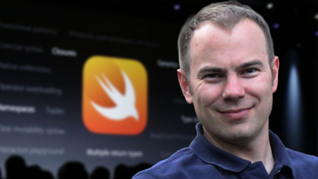

# 1.Swift介绍

## 简介

- Swift 语言由苹果公司在 2014 年推出，用来撰写 Mac OS 和 iOS 应用程序

- Apple WWDC 2014 横空出世

  

## 历史

- 2010 年 7 月，苹果开发者工具部门总监  Chris Lattner  开始着手 Swift 编程语言的设计工作
- 用一年时间，完成基本架构
- Swift 大约历经 4 年的开发期，2014 年 6 月发表，目前最新版本5.1
- 2015年12月4日，苹果公司宣布其Swift编程语言开放源代码
- Chris Lattner
  - LLVM 项目的主要发起人与作者之一
  - Clang 编译器的作者
  - 苹果公司『开发者工具』部门的主管
  - 领导Xcode、Instruments等编译器团队
  - Swift的大部分基础架构由他完成
  - Apple -> Tesla -> Google

Chris Lattner

## 特点

- 特点
  - 从它的语法中能看到JavaScript、Python、Java等语言的影子
  - 语法简单、代码简洁、使用方便
  - 可与Objective-C混合使用（混合编译）
  - 提供了很多Objective-C中没有的新特性

- 为什么设计Swift语言
  - 专为安全
  - 高效强大

## 重要性

- 苹果目前在大力推广Swift
- 已经出现Swift Only的API，如SwiftUI
- 很多企业招聘需要会Swift，以后Swift必将代替OC
- 学习建议:
  - 先学习Swift基本语法
  - 应用于开发，进一步研究

## 资源网站

[https://www.w3cschool.cn/swift/](https://www.w3cschool.cn/swift/)

