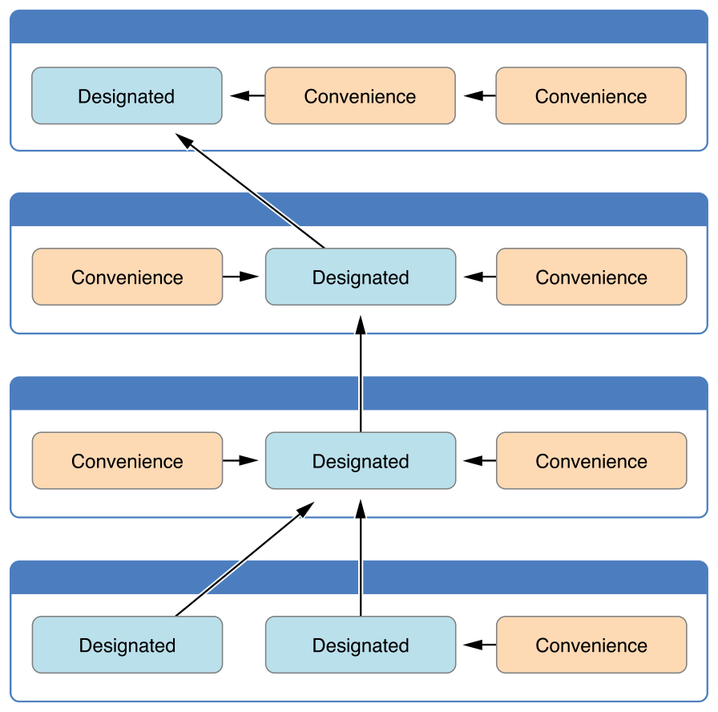

# 19.Swift构造函数与析构函数

## 重要说明

- 本文中提到的**构造函数**，在很多书中有其他的说法，如构造器，构造方法，初始化，初始函数等
- 本文中提到的**析构函数**，在很多书中有其他的说法，如反构造器，析构方法，反初始化，反初始函数等

## 构造函数的介绍

- 构造函数用于初始化一个类的实例（创建对象）
- 默认情况下载创建一个类时,必然会调用一个构造函数
- 即便是没有编写任何构造函数,编译器也会提供一个默认的构造函数
- 如果是继承自NSObject,可以对父类的构造函数进行重写

## 默认构造函数

- 在创建类和结构体的实例时必须为所有的存储属性设置一个合适的初始值,如果不是在定义时初始化值,可以在构造函数中赋值
- 构造函数就像一个没有形式参数的实例方法，使用 `init` 关键字来写

```swift
class Person {
    var name:String
    var age:Int
    var sex:String
    //1.构造函数没有func修饰
    //2.构造函数默认完成调用 不能手动调用
    init() {      
        print("被调用")
        name = "Zhangsan"
        age = 10
        sex = "male"
    }
}
var p = Person()
p.age
p.name
p.sex
```

### 自定义构造函数

- 希望在创建一个对象时手动给属性赋值(属性的值是在外面传进去的)
- 可以自定义构造函数
- 自定义构造函数和默认构造函数可以同时存在

```swift
//定义类
class Person {
    var name:String
    var age:Int
    var sex:String
    //默认构造函数
    init() {

        print("被调用")
        name = "Zhangsan"
        age = 10
        sex = "male"
    } 
    //自定义构造函数
    init(name:String, age:Int, sex:String) {        
        self.name = name
        self.age = age
        self.sex = sex   
    }
}
var p = Person()
p.age
p.name
p.sex

var p2 = Person(name: "Wangli", age: 11, sex: "female")
p2.age
p2.name
p2.sex
```

## 结构体类型的成员构造函数

- 如果结构体类型中没有定义任何自定义构造函数，它会自动获得一个成员构造函数

```swift
//定义了一个名为 Size 有两个属性分别是 width 和 height 的结构体，这两个属性通过分配默认值 0.0 ，从而被推断为 Double 类型
struct Size {
    var width = 0.0, height = 0.0
}
//Size 结构体自动接收一个 init(width:heght:) 构造函数
let twoByTwo = Size(width: 2.0, height: 2.0)
```

## 值类型的构造函数委托

- 构造函数可以调用其他构造函数来执行部分实例的初始化。这个过程，就是所谓的`构造函数委托`
- 构造函数委托对于值类型和类类型是不同的。
- 值类型(结构体和枚举)不支持继承，所以它们的构造函数委托的过程相对简单
- 注意如果为值类型定义了自定义构造函数，就不能访问默认构造函数或者是成员构造函数

```swift
struct Size {
    var width = 0.0, height = 0.0
    init() {    
        //构造函数委托
        self.init(width: 2.0, height: 2.0)
    }
    init(width:Double, height:Double) {
        self.width = width
        self.height = height
    }
}
//要么不要写任何构造函数，要么全写所有的构造函数，否则下面第二种调用方式会有问题，参考上面第四条
var size = Size()
size.width
size.height
var size2 = Size(width: 1.2, height: 1.2)
size2.width
size2.height
```

## 类的继承和初始化

- 所有类的存储属性——包括从它的父类继承的所有属性都必须在初始化期间分配初始值。
- Swift 为类类型定义了两种构造函数以确保所有的存储属性接收一个初始值，它们就是指定构造函数(Designated Initializer)和便捷构造函数(Convenience Initializer)
  - 指定构造函数是类的主要构造函数。指定构造函数可以初始化所有类引用的属性并且调用合适的父类构造函数来继续这个初始化过程给父类链
  - 一个类通常只有一个指定构造函数并且每个类至少得有一个指定构造函数
  - 便捷构造函数是次要的，可以在相同的类里定义一个便捷构造函数来调用一个指定构造函数给指定构造函数设置默认形式参数

```swift
//类的指定构造函数
init(parameters) {
    statements
}
//便捷构造函数有着相同的书写方式，但是要用 convenience 修饰符放到 init 关键字前，用空格隔开
convenience init(parameters) {
    statements
}
```

## 类类型的构造函数委托

- 为了简化指定和便捷构造函数之间的调用关系，Swift 在构造函数之间的委托调用有下面的三个规则:

  - 规则 1——`指定构造函数`必须从它的直系父类调用`指定构造函数`
  - 规则 2——`便捷构造函数`必须从相同的类里调用另一个`构造函数(可以是指定也可以是便捷)`
  - 规则 3——`便捷构造函数`最终必须调用一个`指定构造函数`

- 简单记忆的这些规则的方法如下：

  - 指定构造函数必须总是向上委托。

  - 便捷构造函数必须总是横向委托。

    

    类类型的构造函数委托

```swift
class Car{
    var speed:Double    
    //Designated Initializer
    init(speed:Double) {
        self.speed = speed
    }
    convenience init(){
        self.init(speed: 60.0)
    }
}

class Bus : Car {    
    var wheels : Int 
    init(wheels: Int) {      
        self.wheels = wheels   
        //由于子类继承了父类中的存储属性 所以必须借助父类的指定构造函数来初始化继承的那个存储属性的值
        //一定要在子类的属性初始化完毕以后调用
        super.init(speed: 120.0)
    }
    convenience init(){    
        self.init(wheels: 6)
    }
    
}
```

## 构造函数的继承与重写

- 在Swift中，子类的构造函数有两种来源，首先是自己拥有的构造函数，其次是从父类中继承过来的构造函数。但是，并不是所有父类构造函数都能够被子类继承。子类继承父类的构造函数是有条件的，遵守以下2个规则：
  - 规则1——如果子类没有定义任何`指定构造函数`，它会自动继承父类`所有指定构造函数`
  - 规则2——如果子类提供了`所有父类指定构造函数`的实现(通过规则1继承来的或者提供自定义实现的)，那么它会自动继承`所有父类便捷初始化器`
- 如果一个子类中任意的构造器和父类的便利构造器一模一样, 不算重写

```swift
class Person {
    var name: String!
    var weight: Double
    // 普通自定义构造函数
    init(name: String) {
        self.name = name
        self.weight = 0.0
    }
    // 定义指定构造函数
    init(name: String, weight: Double) {
        self.name = name
        self.weight = weight
    }
    
    // 定义便利构造函数
    convenience init(n name: String, w weight: Double) {
        // 便利构造函数必须调用同类中的指定构造函数
        self.init(name: name, weight: weight)
    }
    
    convenience init(showStr: String) {
        self.init(name: "", weight: 0.0)
        print(showStr)
    }
}

class Man: Person {
    var sex: String = "男"
    override init(name: String) {
        super.init(name: name)
        self.name = name
        self.weight = 0.0
    }
    override init(name: String, weight: Double) {
        
        self.sex = "女"
        // 子类的指定构造函数中必须调用父类的构造函数
        // 重写的时候，必须将调用父类的构造函数语句放在调用父类属性的前面
        super.init(name: name, weight: weight)
        self.name = name
        self.weight = weight
    }
    // 定义构造函数与父类的便利构造函数一样, 这里不算重写
    convenience init(showStr: String) {
        self.init(name: "", weight: 0.0)
        print(showStr)
    }
}

var manA = Man(name: "ZhangSan", weight: 62.0)
var manB = Man(showStr: "Hello Swift")
```

## 可失败的构造函数

- 定义类、结构体或枚举初始化时可以失败
- 失败可能由以下几种方式触发，包括给初始化传入无效的形式参数值，或缺少某种外部所需的资源，又或是其他阻止初始化的情况
- 为了处理这种可能，在类、结构体或枚举中定义一个或多个可失败的构造函数。通过在 init 关键字后面添加问号`init?`
- 可失败的构造函数里面应该有一个 `return nil` 的语句(虽然没有也不报错)
- 通过可失败的构造函数构造出来的实例是一个可选型

```swift
struct Animal {
    let species: String
    init?(species: String) {
        //  返回一个nil
        if species.isEmpty { return nil }
        self.species = species
    }
}
//返回的类型是当前类型的可选型
let cat = Animal(species: "CAT")
if let cat = cat {   
    cat.species
}
let dog = Animal(species: "")
if let dog = dog {   
    dog.species   
}
```

## 必要构造函数

- 在类的构造函数前添加`required` 修饰符来表明表明它是一个`必要构造函数`
- 当子类重写父类的必要构造函数时，必须在子类的构造函数前也要添加 required 修饰符以确保当其它类继承该子类时，该构造函数同为必要构造函数
- 在重写父类的必要构造函数时，不需要添加 `override` 修饰符

```swift
class SomeClass {
    required init() {
    }
}
```

```swift
class SomeSubclass: SomeClass {
    required init() {
    }
}
```

## 析构函数

- Swift 会自动释放不再需要的实例以释放资源
  - Swift 通过自动引用计数（ARC）处理实例的内存管理
  - 当引用计数为0时,系统会自动调用析构函数(不可以手动调用)
  - 通常在析构函数中释放一些资源(如移除通知等操作)
- 析构函数的写法

```swift
//后面连()都没有
deinit {
    // 执行析构过程
}
```

### 示例练习

```swift
class Person {
    var name : String
    var age : Int

    init(name : String, age : Int) {
        print("Person-init")
        self.name = name
        self.age = age
    }

    deinit {
        print("Person-deinit")
    }
}

var person : Person? = Person(name: "Zhangsan", age: 18)
person = nil
```