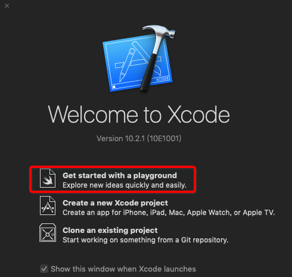
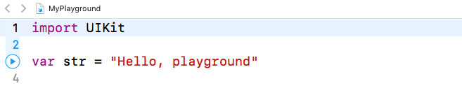

# 2.Swift初探

## Playground是什么?

- 从Xcode6开始出现(Swift开始出现)
- 翻译为:操场/游乐场
- 对于学习Swift基本语法非常方便
  - 所见即所得(快速查看结果)
  - 语法特性发生改变时,可以快速查看



Playground

## Swift最基本的语法变化



第一个Playground

- 导入框架 import UIKit

- 定义标识符时，必须声明该标识符是变量还是常量

  - 声明标识符的格式:　`变量/常量关键字 名称 : 数据类型`

- 语句结束可以不加

  ```
  ;
  ```

  - 如果同一行有多个语句,则依然需要加
  - 但是不建议一行多条语句

- Swift中的打印语句:`print(打印的内容)`

#### 常见注释

- 单行注释
  - Swift 中的注释与C 语言的注释非常相似
  - 单行注释以双正斜杠（//）作为起始标记

```
// 注释内容
```

- 多行注释
  - 其起始标记为单个正斜杠后跟随一个星号`/*`
  - 终止标记为一个星号后跟随单个正斜杠`*/`

```swift
/* 这是一个,
多行注释 */
```

- 和与 C 语言多行注释不同，Swift 的多行注释可以嵌套在其它的多行注释之中

```swift
/* 这是第一个多行注释的开头
/* 这是第二个被嵌套的多行注释 */
这是第一个多行注释的结尾 */
```

- 文档注释
  - Swift中添加文档注释较为简单
  - 使用`///`可以为方法或者属性添加文档注释

```swift
/// 打电话给某人
func callPhone(phoneNum : String) {
    print("打电话给\(phoneNum)")
}
```

- 分组注释
  - Swift中不再使用OC中的 `#pragma mark -`
  - 如果打算对代码进行分组可以使用如下方式
     `// MARK:-`