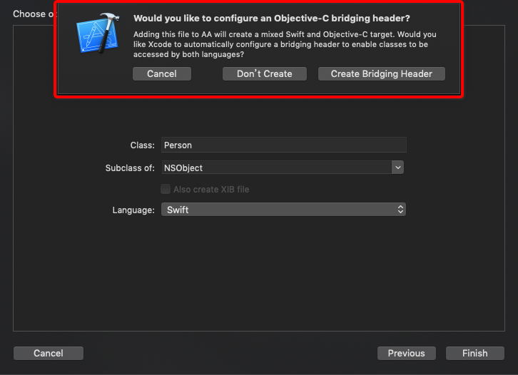
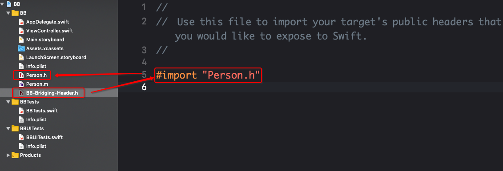

# 27.Swift与OC混编

在目前iOS开发语言从Objective-C到Swift的过渡时期，开发中难免会碰到两种语言同时存在的情况，如果在同一个项目中，两种语言并存，那么该项目就是一个混合项目。在混合项目中，就会存在语言相互调用的情况，那么一个是上世纪的“老人”，一个是初出茅庐的“少年”，它们的沟通是存在障碍的，如何才能在一个项目中让两种语言可以相互调用呢？Apple给我们做好了“桥接”工作，但是在Objective-C的项目中调用Swift与在Swift项目中调用Objective-C，处理的方式是不一样的，下面来进行一个简单的介绍。

## 一、Objective-C的项目中调用Swift

1. 新建一个Objective-C的iOS项目

2. 创建一个Swift的类，继承自NSObject，这时候会有如下的提示，此时选择

   ```swift
   Create Bridging Header
   ```

   


这短话的大意：`添加这个文件会创建一个Objective-C和Swift的混合项目，你是否希望Xcode自动配置一个桥接头文件来让两种语言的类文件相互可见？`

1. 此时项目中会多出两个文件，分别是创建的Swift文件和Bridging Header文件，Bridging Header文件里面虽然什么都没有，但是已经帮我们做了很多事情。Swift文件如下：

```swift
class Person: NSObject {

}
```

1. 在Objective-C的类中导入头文件，注意此时导入的头文件是一个命名为`项目名-Swift.h`的头文件，而不是Bridging Header文件，该头文件是自动生成的并且对开发者透明
2. 在Swift代码中将需要暴露给OC调用的属性和方法前加上 `@objc`修饰符，关于这个内容可查看之前的博文

```swift
class Person: NSObject {  
    @objc func eat(){      
        print("吃饭了")
    }
}
```

1. 最后直接在OC代码中调用Swift

```swift
#import "ViewController.h"
#import "AA-Swift.h"

@interface ViewController ()

@end

@implementation ViewController

- (void)viewDidLoad {
    [super viewDidLoad];
    
    Person *person = [[Person alloc]init];
    [person eat];
}
@end
```

## 二、Swift项目中调用Objective-C

1. 新建一个Swift的iOS项目
2. 创建一个Objective-C的类，此时也会有如一中的文字提示，修改类文件如下：

```swift
@interface Person : NSObject
-(void)eat;
@end

@implementation Person
-(void)eat{
    NSLog(@"吃饭了");
}
@end
```

1. 在Bridging Header文件中导入所有的需要使用的Objective-C类的头文件，如图所示：

   

2. 直接在Swift文件中使用Objective-C里面定义的内容

```swift
import UIKit

class ViewController: UIViewController {

    override func viewDidLoad() {
        super.viewDidLoad()
        
        let person = Person()
        person.eat()
    }
}
```

## 关于Bridging Header文件

如果Bridging Header文件不是Xcode帮助新建的，而是自己新建的头文件，那么会因为找不到“桥接文件”而编译失败，此时需要在 `building setting`里搜索`bridging`关键字，将文件的路径值改成实际文件的路径即可。