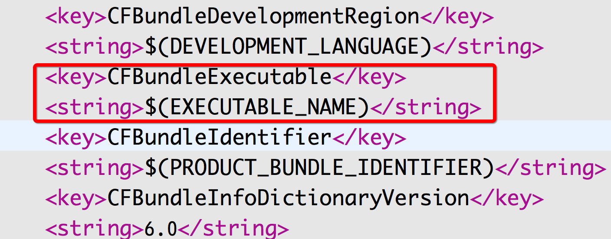
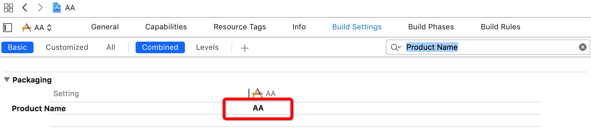

# 28.Swift的命名空间

命名空间`namespace`在C++、C#里面是一个常见概念，Swift中也引入了这样一个机制，下面来探索一下这个命名空间的来龙去脉。

## 一、为什么需要命名空间

> 简而言之一句话：为了避免命名的冲突

在开发中，尤其是在多模块开发中，很难保证模块之间的类名不会重复，为了保证不同模块下同名的类可以正常使用而不报错，引入命名空间来保证即使创建的类名一样，只要命名空间不一样，这些类也是不一样的，所以，这是一种安全机制，用命名空间来防止冲突。可以看出，Swift中的类名的完整形式其实是**“命名空间+类名”**。我们可以尝试在类中打印当前类来查看一下完整名字：

```swift
override func viewDidLoad() {
    super.viewDidLoad()
    print(self)
}
//打印结果是：<AA.ViewController: 0x7fec6a00e5c0>
```

## 二、命名空间查看与修改

从上面的打印结果来看，命名空间是我们项目的名字，那么如果查看呢？我们需要用源代码的形式打开`Info.plist`，可以看到里面有一个字段`CFBundleExecutable`，它对应的值就是命名空间。




如果要修改命名空间，注意不要直接编辑`Info.plist`，可以进入`Build Settings`中搜索`Product Name`，然后进行修改。




## 三、命名空间如何获取

既然知道可以通过`Info.plist`获取命名空间，那么如何在程序中获取呢？很显然需要解析`Info.plist`文件，拿到`CFBundleExecutable`对应的value值。

```swift
let namespace = Bundle.main.infoDictionary!["CFBundleExecutable"]
// 返回的是一个可选型      
print(namespace!)
```

## 四、命名空间在开发中的使用

开发中有一种常见的情形，就是自定义`TabBarController`，然后在里面添加一个个子控制器，这里面常常存在一个问题：通过一个控制器名(字符串)来创建一个控制器(类)。下面对比一下Objective-C与Swift两种语言的实现方式。

- 由于Objective-C中没有命名空间，所以写起来很轻松。

```swift
//viewDidLoad中添加一个个控制器
- (void)viewDidLoad {
    [super viewDidLoad];
    [self addNavigationChildVC:@"ContactViewController" :@"联系人" :@"tabbar_contacts" :@"tabbar_contactsHL"];
}

//自定的方法中根据传进来的字符串创建控制器
-(void)addNavigationChildVC: (NSString *) vcName :(NSString *)title :(NSString *)nomalImageName :(NSString *)selectedImageName {
    //创建控制器
    Class class = NSClassFromString(vcName);
    UIViewController *vc = [[class alloc]init];
    ...
}
```

- Swift中命名空间的存在，如果按照上述做法得不到想要的结果，此时需要想办法进行处理

```swift
//viewDidLoad中添加一个个控制器
override func viewDidLoad() {
    super.viewDidLoad()
    addChildViewController(vcName: "ContactsViewController", title: "联系人", image: "tabbar_contacts", selectedImage: "tabbar_contactsHL")
}

//创建一个函数来将控制器的名字转成具体的类
func stringToVC(vcName:String) -> UIViewController? {
    //获取命名空间
    guard let namespace = Bundle.main.infoDictionary!["CFBundleExecutable"] as? String else {
        print("获取失败")
        return nil
    }        
    //拼接完整的类
    guard let vcClass = NSClassFromString(namespace + "." + vcName) else {
        print("拼接失败")
        return nil
    }   
    //转换成UIViewController
    guard let vcType = vcClass as? UIViewController.Type else {
        print("转换失败")
        return nil
    }  
    //根据类型创建对应的控制器
    let vc = vcType.init()
    return vc
}
```

