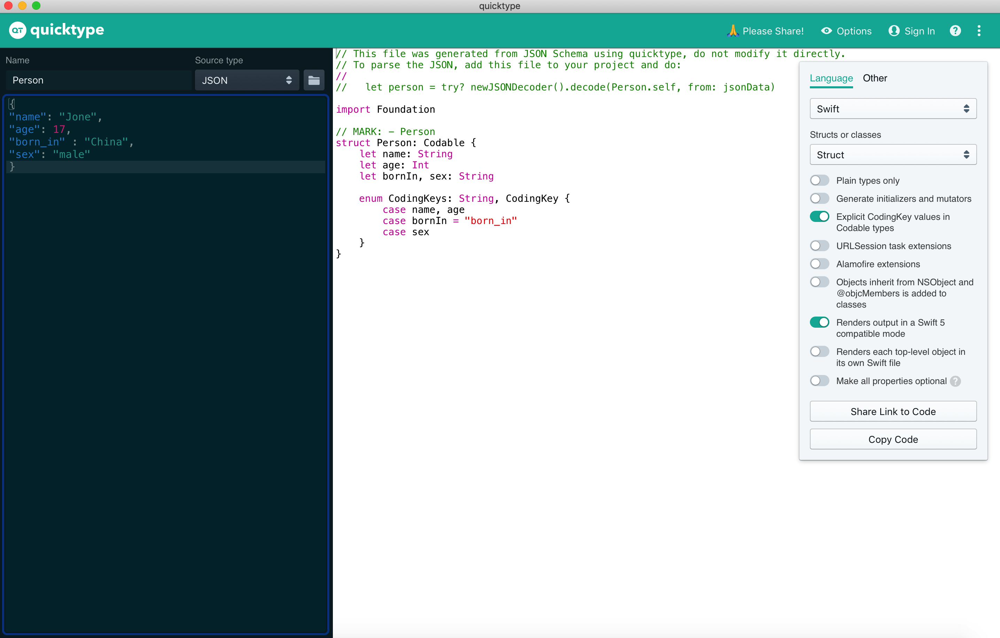

# 29.Swift之Codable协议

## Codable协议

- 开发中经常会碰到结构体或者类与 `JSON`数据的相互转换，尤其是`JSON`转`Model`
- 以前可以利用`KVC、NSJSONSerialization`实现`JSON`转`Model`
- Swift 4 之后推荐使用`Codable`协议，可以通过编码和解码两个操作实现`JSON`与`Model`之间的互转
- 案例

```swift
import UIKit

//JSON
let res = """
{
"name": "Jone",
"age": 17,
"born_in" : "China",
"sex": "male"
}
"""

//定义结构体实现Codable，一般情况下字段要与JSON的key一致，否则需要额外处理
struct Student: Codable {
    let name: String
    let age: Int
    let born_in :String
    let sex: String
}

//JSON -> 结构体/类 解码 decode
let decoder = JSONDecoder()
do {
    
    let stu:Student =  try decoder.decode(Student.self, from: res.data(using: .utf8)!)    
    print("name = \(stu.name) , age = \(stu.age) , born_in = \(stu.born_in) , sex = \(stu.sex)")
    
} catch  {    
    print(error)
}


print("---------------------------")

//结构体/类 -> JSON 编码 encode
let student = Student(name: "zhangsan", age: 20, born_in: "AnHui", sex:"female")
let encoder = JSONEncoder()
encoder.outputFormatting = .prettyPrinted

do {
    
    let data = try encoder.encode(student)  
    print(String(data: data, encoding: .utf8)!)
    
} catch  {    
    print(error)
}
```

## 字段不匹配处理

- 当`JSON`的`key`与`Model`中的字段不一致时，需要进行处理，比如将上面例子中`Student`结构体中的 `let born_in :String` 改成 `let bornIn :String`，运行程序就会报错
- 需要用`CodingKeys`解决字段不一致的情况，需要注意的是，哪怕只有一个字段不一致，也需要在里面将所有字段列出，否则会报错

```swift
import UIKit

//JSON
let res = """
{
"name": "Jone",
"age": 17,
"born_in" : "China",
"sex": "male"
}
"""

//定义结构体实现Codable，一般情况下字段要与JSON的key一致，否则需要额外处理
struct Student: Codable {
    let name: String
    let age: Int
    let bornIn :String
    let sex: String
    
    //所有属性写全 会同时影响编码与解码
    enum CodingKeys :String, CodingKey {
        case name
        case age
        case bornIn = "born_in"
        case sex
    }
}

//JSON -> 结构体/类 解码 decode
let decoder = JSONDecoder()
do {
    
    let stu:Student =  try decoder.decode(Student.self, from: res.data(using: .utf8)!)
    print("name = \(stu.name) , age = \(stu.age) , bornIn = \(stu.bornIn) , sex = \(stu.sex)")
    
} catch  {
    print(error)
}


print("---------------------------")

//结构体/类 -> JSON 编码 encode
let student = Student(name: "zhangsan", age: 20, bornIn: "AnHui", sex:"female")
let encoder = JSONEncoder()
encoder.outputFormatting = .prettyPrinted

do {
    
    let data = try encoder.encode(student)
    print(String(data: data, encoding: .utf8)!)
    
} catch  {
    print(error)
}
```

## 推荐一个软件

开发中推荐使用`Paste JSON as Code • quicktype`软件，可以根据`JSON`快速生成`Model`文件

