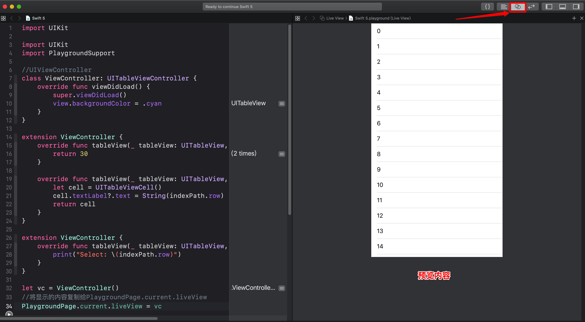

# 30.Swift playground可视化开发

## 介绍

- 可以在`playground`里面进行界面开发，虽然不推荐，但确实可以
- 需要引入 `PlaygroundSupport`
- `PlaygroundPage.current.liveView`是展示内容的那个`view`，将需要展示的内容赋值给它即可
- 应用：`SwiftUI` 是`Xcode11`中的新功能，要求`macOS 10.15`才可以开启预览功能，其实不升级系统，可以利用`playground可视化开发`来实现预览

## 案例

```swift
import UIKit
import PlaygroundSupport

//UIViewController
class ViewController: UITableViewController {
    override func viewDidLoad() {
        super.viewDidLoad()
        view.backgroundColor = .cyan
    }
}

extension ViewController {
    override func tableView(_ tableView: UITableView, numberOfRowsInSection section: Int) -> Int {
        return 30
    }
    
    override func tableView(_ tableView: UITableView, cellForRowAt indexPath: IndexPath) -> UITableViewCell {
        let cell = UITableViewCell()
        cell.textLabel?.text = String(indexPath.row)
        return cell
    }
}

extension ViewController {
    override func tableView(_ tableView: UITableView, didSelectRowAt indexPath: IndexPath) {
        print("Select: \(indexPath.row)")
    }
}

let vc = ViewController()
//将显示的内容复制给PlaygroundPage.current.liveView
PlaygroundPage.current.liveView = vc
```

## 开启预览

