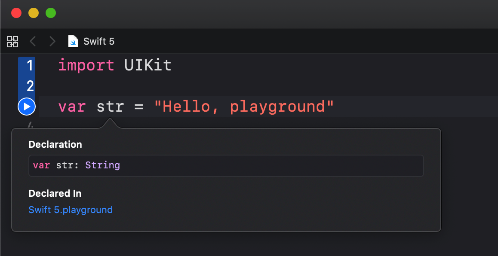

# 4.Swift数据类型

## Swift类型的介绍

- Swift中的数据类型也有:整型/浮点型/Bool型/元组/枚举/结构体/对象类型等
- 基本类型
- 整型
  - 有符号
    - Int8 : 有符号8位整型
    - Int16 : 有符号16位整型
    - Int32 : 有符号32位整型
    - Int64 : 有符号64位整型
    - Int : 和平台相关(默认,相当于OC的NSInteger)
  - 无符号
    - UInt8 : 无符号8位整型
    - UInt16 : 无符号16位整型
    - UInt32 : 无符号32位整型
    - UInt64 : 无符号64位整型
    - UInt :和平台相关(默认,相当于OC的NSUInteger)
  - 浮点型
    - Float : 32位浮点型
    - Double : 64浮点型(默认)
  - Bool型
    - true : 真
    - false : 假

```swift
// 定义一个Int类型的变量m,并且赋值为10
var m : Int = 10
// 定义一个Double类型的常量n,并且赋值为3.14
let n : Double = 3.14
//定义一个Bool类型
let t : Bool = true
```

## Swift中的类型推导

- Swift是强类型的语言，强类型语言也称为强类型定义语言，是一种总是强制类型定义的语言，要求变量的使用要严格符合定义，所有变量都必须先定义后使用
- Swift中任何一个变量/常量都有明确的类型
- 注意:
  - 如果定义一个标识符时有直接进行赋值，那么标识符后面的类型可以省略
  - Swift有类型推导，会自动根据后面的赋值来决定前面的标识符的数据类型
  - 可以通过`option+鼠标左键`来查看变量的数据类型



查看类型

```swift
// 定义变量时没有指定明确的类型,但是因为赋值给i一个20是一个Int类型的数据.因此i为Int类型
var i = 20
// 错误写法:如果之后赋值给i一个浮点型数值,则会报错
// i = 30.5

// 正确写法
var j = 3.33
j = 6.66
```

## Swift中基本运算

- Swift中在进行基本运算时必须保证数据的类型一致,否则会出错

  - 只有相同类型的数据才可以进行运算

  - Swift中没有隐式转换，数据类型的转化必须显示: 

    ```
    类型()
    ```

    - Int类型转成Double类型:Double(标识符)
    - Double类型转成Int类型:Int(标识符)

```swift
let a = 10
let b = 3.14

// 错误写法
// let c = a + b
// let c = a * b

// 正确写法
let c = Double(a) + b
let d = a + Int(b)
```